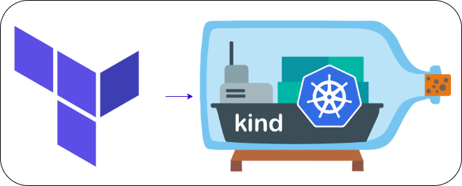

<div align="center" id="top"> 
  

&#xa0;

  <!-- <a href="https://kindtf.netlify.app">Demo</a> -->
</div>

<h1 align="center">Kubernetes in Docker with Terraform</h1>

<p align="center">
  
  
  
  

  <!--  -->

  <!--  -->

  <!--  -->
</p>

<!-- Status -->

<!-- <h4 align="center">
	🚧  Kind Tf 🚀 Under construction...  🚧
</h4>

<hr> -->

<p align="center">
  <a href="#dart-about">About</a> &#xa0; | &#xa0; 
  <a href="#rocket-technologies">Technologies</a> &#xa0; | &#xa0;
  <a href="#white_check_mark-requirements">Requirements</a> &#xa0; | &#xa0;
  <a href="#checkered_flag-starting">Starting</a> &#xa0; | &#xa0;
  <a href="#memo-license">License</a> &#xa0; | &#xa0;
  <a href="https://github.com/devenes" target="_blank">Author</a>
</p>

<br>

## :dart: About

This project is a simple example of how to use Terraform to create a Kubernetes cluster in Docker using Kind.

## :rocket: Technologies

The following tools were used in this project:

- [Terraform](https://www.terraform.io/)
- [Kind](https://kind.sigs.k8s.io/)

## :white_check_mark: Requirements

Before starting :checkered_flag:, you need to have [Git](https://git-scm.com), [Docker](https://www.docker.com/), [KinD](https://kind.sigs.k8s.io/) and [Terraform](https://www.terraform.io/) installed.

## :checkered_flag: Starting

Clone this project

```bash
git clone https://github.com/devenes/kind-terraform
```

Access the project folder

```bash
cd kind-terraform
```

Inıtialize Terraform

```bash
terraform init
```

Plan the Terraform execution

```bash
terraform plan
```

Apply the Terraform execution

```bash
terraform apply
```

## :memo: License

This project is under license from MIT. For more details, see the [LICENSE](LICENSE) file.

Made with :heart: by <a href="https://github.com/devenes" target="_blank">devenes</a>

&#xa0;

<a href="#top">⬆️ Back to top</a>
